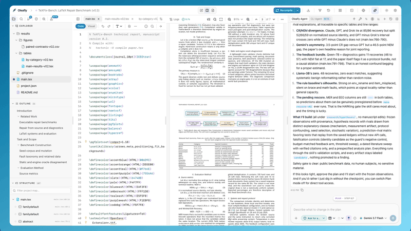
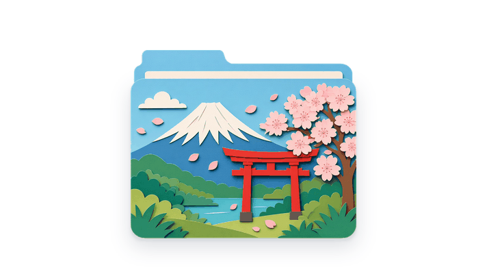
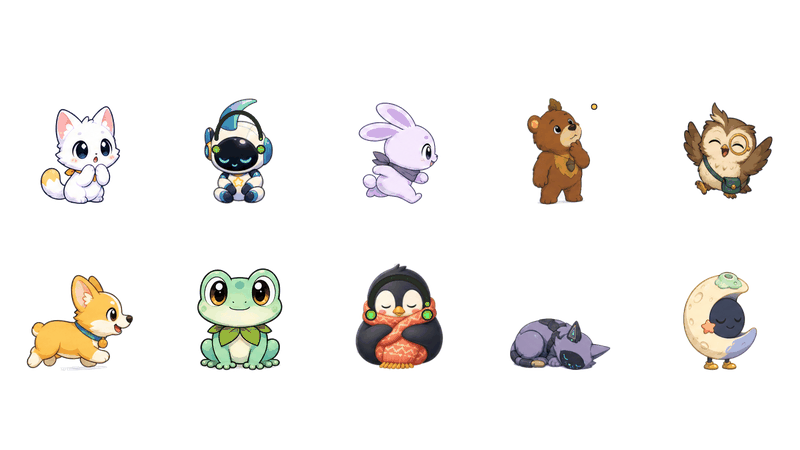
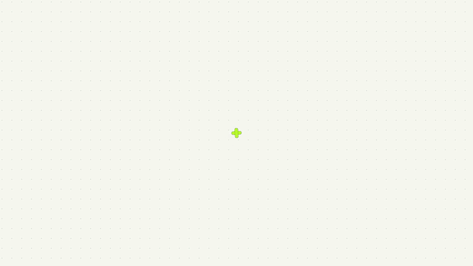

### What I'm building

<table>
<tr>
<td width="50%" valign="top">

<h3><a href="https://github.com/Oleafly/Oleafly">Oleafly</a></h3>

The local-first, AI-assisted research workspace for scientific writing and publishing. Research, write, compile, verify and publish in LaTeX, Typst or Markdown. Git-native, open source, desktop performance.

</td>
<td width="50%" valign="top">
<picture><source media="(prefers-color-scheme: dark)" srcset="assets/folderskin-dark.gif"></picture>
<h3><a href="https://github.com/prajwal-svm/folderskin">FolderSkin</a></h3>

Give any folder a skin. A free, open-source folder icon changer for macOS, Windows and Linux: skins from community packs, your own photos, or folders painted by AI.

</td>
</tr>
<tr>
<td width="50%">
  
</td>
<td width="50%">
  
</td>
</tr>
</table>

<table>
<tr>
<td width="50%" valign="top">
<picture><source media="(prefers-color-scheme: dark)" srcset="assets/peekling-dark.gif"></picture>
<h3><a href="https://github.com/peekling/peekling-engine">Peekling</a></h3>

Tiny interactive friends for your website. A dependency-free browser runtime and tooling for interactive Peekling characters.

</td>
<td width="50%" valign="top">

<h3><a href="https://github.com/prajwal-svm/product-promo-harness">product-promo-harness</a></h3>

One script in, a launch video out. A Claude Code harness for showreel-grade product promos.

</td>
</tr>
<tr>
<td width="50%">
  
</td>
<td width="50%">
  
</td>
</tr>
</table>
